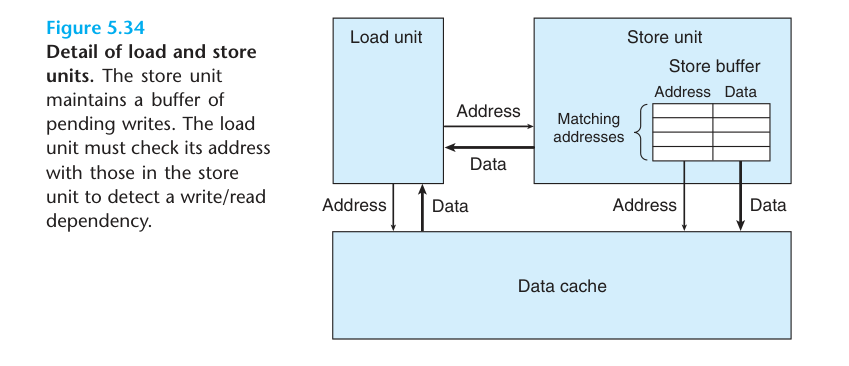

# 现代处理器内存性能分析

## 一、缓存与内存操作概述
现代处理器通过缓存机制加速小数据量访问（如长度<1000的数组）。本章重点分析数据全在缓存时的load/store性能，第6章将深入讨论缓存机制。

### 关键硬件特性
- **专用功能单元**：独立load/store单元，支持流水线操作
- **并行能力**（示例机型配置）：
  - 2个load单元，各支持72个待处理读请求
  - 1个store单元，支持42个待处理写请求
  - 每周期可启动1次操作

## 二、Load操作性能分析
### 基础限制
- 最小CPE=0.50（因需1 load/元素，2个load单元）
- 通用公式：若需k次load/元素 → CPE ≥ k/2

### 延迟影响案例：链表遍历
```c
typedef struct ELE {
    struct ELE *next;
    long data;
} list_ele, *list_ptr;

long list_len(list_ptr ls) {
    long len = 0;
    while (ls) {
        len++;
        ls = ls->next;  // 关键依赖点
    }
    return len;
}
```
**汇编关键循环**：
```asm
.L3:
    addq  $1, %rax      ; len++
    movq  (%rdi), %rdi  ; ls = ls->next（CPE=4.0的瓶颈）
    testq %rdi, %rdi
    jne   .L3
```
**性能分析**：  
每个`movq`需等待前次load完成，实测CPE=4.0与L1缓存延迟一致。

## 三、Store操作特性
### 基础性能
- 独立store单元可实现CPE=1.0（如数组清零）
```c
void clear_array(long *dest, long n) {
    for (long i = 0; i < n; i++)
        dest[i] = 0;  // 纯store操作
}
```

### Store-Load交互
#### 关键现象：写/读依赖
```c
void write_read(long *src, long *dst, long n) {
    long val = 0;
    while (n--) {
        *dst = val;          // store
        val = (*src) + 1;    // load
    }
}
```
**两种场景对比**：

| 场景 | 调用示例 | 行为 | CPE |
|------|----------|------|-----|
| 地址独立 | `write_read(&a[0], &a[1], N)` | load不受store影响 | 1.3 |
| 地址相同 | `write_read(&a[0], &a[0], N)` | load依赖前次store | 7.3 |

#### 硬件机制

1. Store缓冲区保存待提交的地址+数据
2. Load操作需检查store缓冲区地址匹配
   - 匹配时：从缓冲区读取数据（产生6周期延迟）
   - 不匹配时：并行执行

## 四、典型案例分析
### 案例1：数组拷贝
```c
void copy_array(long *src, long *dest, long n) {
    for (long i = 0; i < n; i++)
        dest[i] = src[i];
}
```
| 调用方式 | 行为 | CPE |
|---------|------|-----|
| `copy_array(a+1, a, 999)` | 前向拷贝 | 1.2 |
| `copy_array(a, a+1, 999)` | 后向拷贝 | 5.0 |
| `copy_array(a, a, 999)` | 自拷贝 | 7.3 |

### 案例2：前缀和优化
原始版本CPE=9.0（受制于连续内存依赖）：
```c
void psum1(float a[], float p[], long n) {
    p[0] = a[0];
    for (long i = 1; i < n; i++)
        p[i] = p[i-1] + a[i];  // 每次需load p[i-1]
}
```
**优化方案**：使用寄存器暂存前次结果 → CPE降至3.0（仅受浮加延迟限制）

## 五、关键结论
1. **Load瓶颈**：吞吐量受单元数量限制，延迟影响依赖链
2. **Store特性**：独立提交但需注意缓冲区交互
3. **优化核心**：
   - 减少不必要的内存依赖
   - 利用寄存器暂存中间结果
   - 注意访问模式（如前后向拷贝差异）