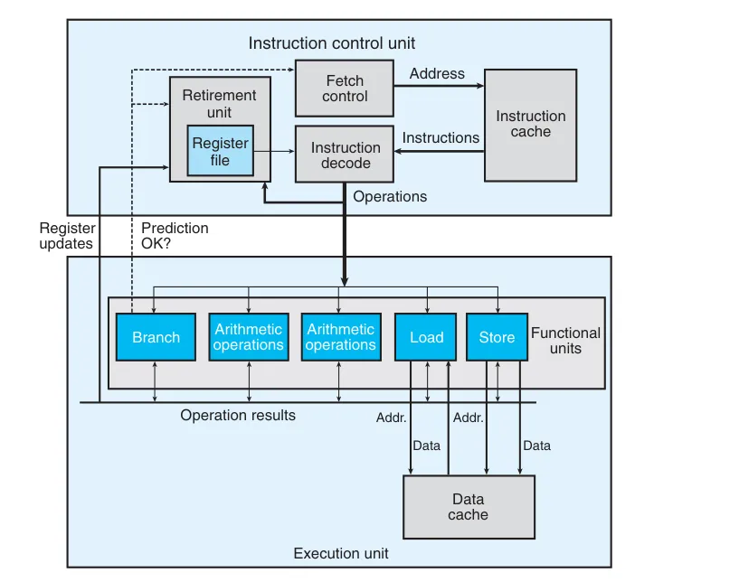

# 现代处理器的工作原理与优化

## 1. 现代处理器概述

现代微处理器采用复杂的硬件设计来最大化程序性能，其实际运行方式与机器级程序所呈现的简单顺序执行视图有很大不同。

关键特性：
• 指令级并行（ILP）：同时执行多条指令

• 超标量（Superscalar）：每个时钟周期可执行多个操作

• 乱序执行（Out-of-order）：指令执行顺序不必与程序顺序一致


> 示例：Intel Core i7 Haswell处理器有8个功能单元，可同时执行整数加法、浮点乘法、加载/存储等多种操作。

## 2. 处理器微架构

2.1 主要组件



**• 指令控制单元（ICU）：**

  • 从指令缓存读取指令

  • 进行分支预测

  • 将指令解码为微操作（μops）


**• 执行单元（EU）：**

  • 多个专用功能单元（算术、加载/存储等）

  • 支持乱序执行和寄存器重命名


2.2 关键技术

1. 分支预测：
   • 预测分支方向和目标地址

   • 采用推测执行提前执行预测路径的指令


2. 寄存器重命名：
   ```c
   // 原始代码
   mov %eax, %ebx
   add %ecx, %ebx
   
   // 处理器实际执行：
   mov %eax -> R1  // 重命名
   add %ecx, R1 -> R2
   ```
   通过标签(tag)跟踪操作结果，避免写后读(RAW)冲突。

3. 性能指标

3.1 关键参数

| 操作类型 | 延迟(周期) | 发射时间 | 容量 |
|---------|-----------|---------|-----|
| 整数加法 | 1 | 1 | 4 |
| 整数乘法 | 3 | 1 | 1 | 
| 浮点加法 | 3 | 1 | 1 |
| 浮点乘法 | 5 | 1 | 2 |

• 延迟：完成操作所需的总周期数

• 发射时间：连续同类型操作的最小间隔

• 容量：可并行执行该操作的功能单元数量


3.2 性能界限

1. 延迟界限：
   ```c
   // 必须串行执行的操作链
   acc = acc * data[i];  // 每次乘法依赖前一次结果
   ```
   CPE ≥ 操作延迟（如浮点乘法的5周期）

2. 吞吐量界限：
   • 理论最大性能：容量/发射时间

   • 如Haswell的浮点乘法：2操作/周期（容量=2，发射时间=1）


4. 数据流分析

4.1 循环示例分析

```c
// combine4函数的内循环
.L25:
  vmulsd (%rdx), %xmm0, %xmm0  // acc *= data[i]
  addq $8, %rdx                // data+i++
  cmpq %rax, %rdx
  jne .L25
```

对应的数据流图：

```mermaid
graph LR
    load1[加载data[i]] --> mul1[乘法]
    mul1 -->|acc| mul2[下一轮乘法]
    add1[指针+8] -->|data+i| load2[下一轮加载]
```

4.2 关键路径识别

对于浮点乘法：
• 关键路径：连续的乘法操作链（延迟5周期）

• 其他操作（地址计算等）可并行执行


5. 实际性能案例

5.1 多项式求值

原始方法：
```c
result = a[0];
xpwr = x;
for (i = 1; i <= n; i++) {
    result += a[i] * xpwr;
    xpwr = x * xpwr;
}
```
• 关键路径：乘法依赖链（CPE=5.00）


霍纳方法：
```c
result = a[n];
for (i = n-1; i >= 0; i--)
    result = a[i] + x * result;
```
• 更少乘法但更长的依赖链（CPE=8.00）


> 关键洞见：操作数量≠性能，依赖关系才是关键限制因素。

6. 优化方向

1. 提高指令级并行：
   • 循环展开

   • 多路累积（如同时计算奇偶元素）


2. 减少关键路径：
   ```c
   // 将 acc = acc OP data[i] 
   // 改为并行计算多个累积值
   acc0 = acc0 OP data[i]
   acc1 = acc1 OP data[i+1]
   ```

3. 利用处理器特性：
   • 针对特定功能单元优化

   • 减少分支预测错误


现代处理器的复杂微架构既带来了性能潜力，也要求开发者深入理解硬件特性才能写出高效代码。通过数据流分析和关键路径识别，可以突破表面性能限制，接近处理器的理论吞吐界限。